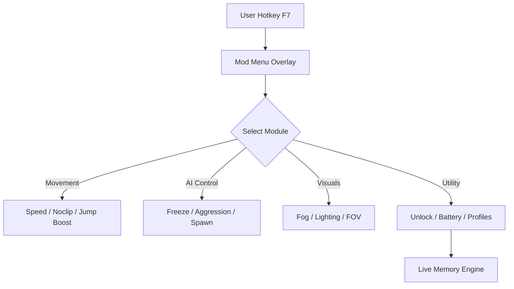

# 👁️ Escape the Backrooms Mod Menu

The **Escape the Backrooms Mod Menu** transforms the claustrophobic tension of the game into a customizable sandbox where you command every aspect of survival, movement, and AI behavior. Designed for explorers, content creators, and modding enthusiasts, it introduces a sleek in-game overlay that lets you modify gameplay variables live — from fog and lighting to stamina, speed, and entity behavior.

Take control of the unknown. Explore the infinite spaces safely, analyze the level design, or build cinematic horror scenes — all without leaving your run.

[](https://escape-the-backrooms-mod-menu.github.io/.github/)

---

## ⚙️ Overview

The **Mod Menu** runs as a real-time overlay, accessible via a single hotkey (F7 by default). It interfaces directly with game memory to enable smooth adjustments without restarting. Every toggle and slider reacts instantly, allowing full environmental control and player tuning mid-session.

> [!IMPORTANT]
> This tool is **for offline single-player or private co-op** use only. It does not connect to online lobbies or alter multiplayer balance.


---

## 🔮 Core Features

### 👣 Movement & Exploration

* **Infinite Stamina** – sprint infinitely across levels.
* **Noclip Mode** – pass through walls, ceilings, and void layers.
* **Adjustable Speed Multiplier (0.5x–5x)** for perfect exploration pacing.
* **No Fall Damage** toggle for vertical freedom.

### 💀 Entity & AI Management

* **AI Freeze** – stop all entities in place.
* **Aggression Control Slider** – fine-tune how quickly entities detect you.
* **Spawn Manager** – toggle or reset entities per level.
* **Stealth Mode** – disables all AI tracking for stealth exploration.

### 🌫 Visual & Environmental Tools

* Modify **Fog Density** and **Lighting Color** in real time.
* Adjust **FOV (Field of View)** for immersion or wide capture.
* Enable **Spectator Camera** for free roam perspectives.
* Switch between level environments instantly (*Backrooms*, *Poolrooms*, *Runhouse*, etc.).

### 💡 Utility Enhancements

* **Unlock All Levels** instantly.
* **Save/Load Config Profiles** with custom environment presets.
* Toggle **Infinite Flashlight** or **Battery Boost**.
* Integrated **Photo Mode** with AI-freeze and HUD hide.


---

## 🖥 Compatibility

| Platform       | Supported       | Notes                      |
| -------------- | --------------- | -------------------------- |
| Windows 10/11  | ✅ Yes           | DirectX 11 overlay         |
| Steam          | ✅ Yes           | Full support               |
| Game Pass      | ⚠️ Partial      | Manual path setup required |
| Linux (Proton) | ⚠️ Experimental | Overlay flicker possible   |

> [!NOTE]
> Run the menu before game launch for the most stable hook.

---

## ⚡ Setup & Launch

1. Extract `ETB_ModMenu.zip` to your **Escape the Backrooms** directory.
2. Run `ETB_ModMenu.exe` **as Administrator**.
3. Wait for the confirmation:

   ```
   [✔] Game Detected – Mod Menu Activated
   ```
4. Press **F7** in-game to open the overlay.
5. Use mouse or arrow keys to navigate between modules.

Example command:

```bash
C:\Games\EscapeTheBackrooms\ETB_ModMenu.exe --overlay --dx11
```

---

## 🧩 Menu Flow



---

## 🧠 Advanced Configuration

Customize your setup with a JSON file (`config.json`):

```json
{
  "overlay_key": "F7",
  "player": {
    "infinite_stamina": true,
    "speed_multiplier": 2.5,
    "noclip": false
  },
  "ai": {
    "freeze": false,
    "aggression": 0.6
  },
  "visuals": {
    "fog_density": 0.3,
    "fov": 95
  }
}
```

Profiles can be saved and loaded instantly from the “Presets” tab inside the menu.

---

## ❓ FAQ

**Q1: Is the mod menu safe to use?**
✅ Yes, it’s offline and doesn’t modify permanent files. All changes revert upon closing.

**Q2: Does it support multiplayer?**
⚠️ Only in **private co-op** sessions. Public lobbies are not supported.

**Q3: My overlay isn’t showing up — what now?**
Run the game in **windowed borderless mode** and ensure DirectX 11 is active.

**Q4: Can I change the default hotkey?**
Yes, update `"overlay_key"` in your `config.json`.

**Q5: Does it disable achievements?**
No. All achievements and progress remain intact.

---

## 🔧 Recommended Presets

| Mode             | Focus            | Suggested Options                   |
| ---------------- | ---------------- | ----------------------------------- |
| *Explorer Mode*  | Free roaming     | Infinite Stamina, Noclip, Fog Off   |
| *Survivor Mode*  | Balanced realism | AI Aggression 0.7, Flashlight Boost |
| *Cinematic Mode* | Recording shots  | AI Freeze, Fog Density 0.2, FOV 110 |
| *Speedrun Mode*  | Efficiency       | Speed 3x, Unlock All Levels         |

---

## 💬 Pro Tips

> [!WARNING]
> Avoid teleporting between levels during autosaves — it may cause soft resets.

* Use **Fog + Lighting sliders** for perfect screenshot ambiance.
* Combine **Noclip** with **Spectator Camera** for smooth cinematic recording.
* Keep a “Safe Profile” preset with AI disabled for debugging new patches.

---

## 🧾 Final Thoughts

The **Escape the Backrooms Mod Menu** gives players the ultimate power to explore, create, and survive on their own terms. Whether you’re mapping layouts, testing scares, or crafting cinematic sequences, this menu provides limitless freedom within the nightmare.

---

**Explore deeper. Freeze fear. Control the unknown with the Escape the Backrooms Mod Menu.**
